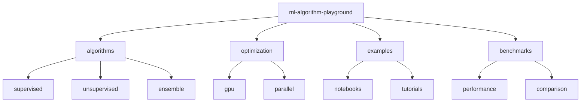

# ML Algorithm Playground 🧪

[](https://www.python.org/downloads/)
[](https://scikit-learn.org/)
[](https://xgboost.readthedocs.io/)
[](https://developer.nvidia.com/cuda-toolkit)
[](LICENSE)

> Core ML algorithm implementations with GPU acceleration. Featuring optimized implementations across various libraries with comprehensive analysis.

[Features](#features) • [Installation](#installation) • [Quick Start](#quick-start) • [Documentation](#documentation) • [Contributing](#contributing)

## 📑 Table of Contents
- [Features](#features)
- [Project Structure](#project-structure)
- [Prerequisites](#prerequisites)
- [Installation](#installation)
- [Quick Start](#quick-start)
- [Documentation](#documentation)
  - [Algorithms](#algorithms)
  - [Optimization](#optimization)
  - [Benchmarks](#benchmarks)
- [Contributing](#contributing)
- [Versioning](#versioning)
- [Authors](#authors)
- [Citation](#citation)
- [License](#license)
- [Acknowledgments](#acknowledgments)

## ✨ Features
- Classical ML algorithm implementations
- GPU-accelerated training
- Performance optimization techniques
- Comparative analysis tools
- Interactive examples and tutorials

## 📁 Project Structure



<details>
<summary>Click to expand full directory structure</summary>

```plaintext
ml-algorithm-playground/
├── algorithms/         # Algorithm implementations
│   ├── supervised/    # Supervised learning
│   ├── unsupervised/ # Unsupervised learning
│   └── ensemble/     # Ensemble methods
├── optimization/      # Optimization utilities
│   ├── gpu/          # GPU acceleration
│   └── parallel/     # Parallel processing
├── examples/         # Example implementations
├── benchmarks/       # Performance tests
├── tests/           # Unit tests
└── README.md        # Documentation
```
</details>

## 🔧 Prerequisites
- Python 3.8+
- CUDA 11.8+
- scikit-learn 1.3+
- XGBoost 2.0+
- NVIDIA GPU (optional)

## 📦 Installation

```bash
# Clone repository
git clone https://github.com/BjornMelin/ml-algorithm-playground.git
cd ml-algorithm-playground

# Create environment
python -m venv venv
source venv/bin/activate

# Install dependencies
pip install -r requirements.txt
```

## 🚀 Quick Start

```python
from ml_playground import algorithms, optimization

# Initialize model with GPU support
model = algorithms.GradientBoosting(
    gpu_acceleration=True,
    n_estimators=100
)

# Train model with automatic optimization
trained_model = optimization.train_with_gpu(
    model,
    X_train,
    y_train,
    optimization_level='O2'
)

# Make predictions
predictions = trained_model.predict(X_test)
```

## 📚 Documentation

### Algorithms

| Algorithm | Type | GPU Support | Performance Gain |
|-----------|------|-------------|-----------------|
| XGBoost | Gradient Boosting | ✓ | 10x |
| K-Means | Clustering | ✓ | 5x |
| SVM | Classification | ✓ | 8x |
| Random Forest | Ensemble | ✓ | 4x |

### Optimization
- GPU acceleration
- Multi-threading
- Memory optimization
- CUDA kernels

### Benchmarks
Algorithm performance comparison:

| Dataset Size | Algorithm | CPU Time | GPU Time | Speedup |
|-------------|-----------|-----------|-----------|----------|
| 1M samples | XGBoost | 45s | 5s | 9x |
| 500K samples | K-Means | 30s | 6s | 5x |
| 2M samples | Random Forest | 120s | 30s | 4x |

## 🤝 Contributing
- [Contributing Guidelines](CONTRIBUTING.md)
- [Code of Conduct](CODE_OF_CONDUCT.md)
- [Development Guide](DEVELOPMENT.md)

## 📌 Versioning
We use [SemVer](http://semver.org/) for versioning. For available versions, see the [tags on this repository](https://github.com/BjornMelin/ml-algorithm-playground/tags).

## ✍️ Authors
**Bjorn Melin**
- GitHub: [@BjornMelin](https://github.com/BjornMelin)
- LinkedIn: [Bjorn Melin](https://linkedin.com/in/bjorn-melin)

## 📝 Citation
```bibtex
@misc{melin2024mlalgorithmplayground,
  author = {Melin, Bjorn},
  title = {ML Algorithm Playground: GPU-Accelerated Machine Learning Implementations},
  year = {2024},
  publisher = {GitHub},
  url = {https://github.com/BjornMelin/ml-algorithm-playground}
}
```

## 📄 License
This project is licensed under the MIT License - see the [LICENSE](LICENSE) file for details.

## 🙏 Acknowledgments
- scikit-learn developers
- XGBoost team
- NVIDIA for CUDA support
- Open source ML community

---
Made with 🧪 and ❤️ by Bjorn Melin
